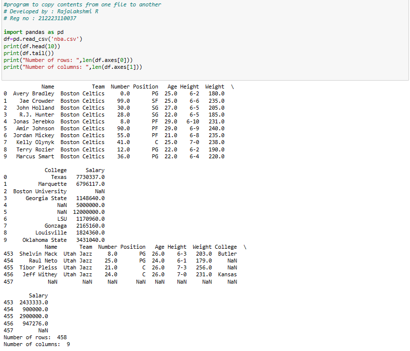

# copy-file
## AIM:
To write a python program for copying the contents from one file to another file.

## EQUIPEMENT'S REQUIRED: 
PC
Anaconda - Python 3.7

## ALGORITHM: 
### Step 1:
Use open function to open the file in which we want to copy from and access it in read mode.

### Step 2: 
Read the file and store in a variable

### Step 3: 
Now create a new file in which we want to paste the content using access mode.

### Step 4:  
Use write function to copy the read file that has been stored in the variable.

### Step 5: 
The content in the original file will be copied in the newfile

### Step 6: 
End the program

## PROGRAM:
```
#program to copy contents from one file to another
# Developed by : Rajalakshmi R
# Reg no : 212223110037

import pandas as pd
df=pd.read_csv('nba.csv')
print(df.head(10))
print(df.tail())
print("Number of rows: ",len(df.axes[0]))
print("Number of columns: ",len(df.axes[1]))

```


### OUTPUT:



## RESULT:
Thus the program is written to copy the contents from one file to another file.